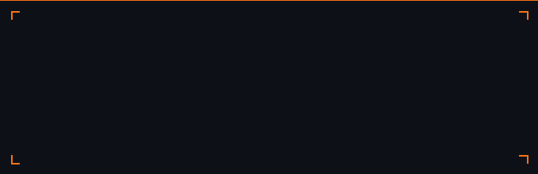

<div align="center">



</div>

---

## ¿De qué va esto?

El periodismo deportivo predice el Draft de la NBA cada año de la misma manera: opiniones de scouts, análisis subjetivos y "corazonadas" de expertos. Todos los artículos dicen lo mismo.

Este proyecto propone algo diferente: **usar Machine Learning para respaldar artículos periodísticos con datos objetivos**. Modelos entrenados con 13 años de estadísticas reales de la NCAA capaces de predecir si un jugador será elegido en el Draft, en qué ronda, en qué rango de pick y a qué perfil de jugador histórico se parece.

El caso de uso: los tres jugadores españoles con opciones reales en el **NBA Draft 2026**.

---

## 🎯 ¿Qué predice el modelo?

| Predicción | Pregunta | Tipo |
|---|---|---|
| **Ronda** | ¿Primera ronda / Segunda ronda / No drafteado? | Clasificación (3 clases) |
| **Rango de pick** | ¿En qué franja del 1 al 60? | Clasificación multiclase (7 clases) |
| **Arquetipo** | ¿A qué perfil físico histórico se parece? | Clustering no supervisado (K-Means) |

---

## 🇪🇸 Los protagonistas

| Jugador | Posición | Liga | Mock consensus | Predicción modelo |
|---|---|---|---|---|
| **Aday Mara** | Pívot | ACB · Barça | ~Pick 9 (lotería) | P(draft) = 95.5% · rango 41-50* |
| **Baba Miller** | Ala-Pívot | NCAA · Florida | ~Pick 45 | P(draft) = 94.9% · rango 41-50 ✓ |
| **Sergio De Larrea** | Base | EuroLeague · Valencia | ~Pick 40 (varianza 28-58) | P(draft) = 88.3% · rango 41-50 |

*La infravaloracion de Aday es el hallazgo más interesante del proyecto: su valor de lotería está en dimensiones físicas y de techo de desarrollo que las estadísticas de temporada no capturan.

---

## 📂 Estructura del repositorio

```
nba-draft-2026-prediccion/
│
├── datos/
│   ├── raw/                          # Fuentes originales sin procesar
│   │   ├── College_BasketballPlayers2009-2021.csv
│   │   ├── combine_historico.csv
│   │   └── nbaplayersdraft.csv
│   └── procesados/                   # Datasets limpios listos para los modelos
│       ├── ncaa_final.csv            # 2.121 jugadores · 37 columnas · 0 NaN
│       ├── combine_final.csv         # 1.873 jugadores · 18 columnas · 0 NaN
│       └── nbaplayersdraft_limpio.csv
│
├── notebooks/
│   ├── limpieza y analisis/
│   │   ├── eda_ncaa.ipynb            # EDA + limpieza + ingeniería de variables
│   │   ├── limpieza_combine.ipynb    # Limpieza del NBA Combine
│   │   └── limpieza_jugadores_historicos.ipynb
│   └── modelos/
│       ├── arquetipos_combine.ipynb  # Clustering K-Means · 7 arquetipos físicos
│       ├── primer_modelo_draft.ipynb       # XGBoost con posición — ronda
│       ├── primer_modelo_draft_v2.ipynb    # + predict_proba para los españoles
│       ├── primer_modelo_eleccion.ipynb    # XGBoost con posición — rango
│       ├── primer_modelo_eleccion_v2.ipynb # + predict_proba para los españoles
│       ├── modelo_ronda_sin_posicion.ipynb # XGB · RF · SVM · KNN — ronda
│       ├── modelo_rango_sin_posicion.ipynb # XGB · RF · SVM · KNN — rango
│       └── memoria_nba_draft_2026.ipynb    # Memoria técnica completa del proyecto
│
├── pkl/
│   ├── modelos/
│   │   ├── kmeans_arquetipos.pkl
│   │   ├── xgb_draft_balanceado.pkl
│   │   ├── xgb_rango_balanceado.pkl
│   │   ├── modelo_ronda_sin_posicion.pkl   # Random Forest — mejor modelo
│   │   └── modelo_rango_sin_posicion.pkl   # Random Forest — mejor modelo
│   ├── preprocesado/
│   │   ├── le_target_draft.pkl
│   │   ├── le_rango.pkl
│   │   ├── le_ronda_sin_posicion.pkl
│   │   ├── le_rango_sin_posicion.pkl
│   │   ├── scaler_combine.pkl
│   │   ├── pca_combine.pkl
│   │   ├── scaler_ronda.pkl
│   │   └── scaler_rango.pkl
│   └── configuracion/
│       └── configuracion_modelo.yaml
│
├── app_streamlit/
│   └── app.py                        # Aplicación interactiva Streamlit
│
├── documentacion/                    # Memoria técnica (.ipynb y .docx)
│
├── presentacion/                     # Presentación del proyecto
│
├── logo.gif
├── logo.svg
└── README.md
```

---

## 📊 Fuentes de datos

### NCAA Histórico → modelo de clasificación
- **Origen:** Kaggle — `College_BasketballPlayers2009-2021.csv`
- **Crudo:** 61.061 registros · 66 columnas
- **Procesado:** 2.121 jugadores · 37 variables · 0 NaN
- 13 años de estadísticas universitarias: puntos, rebotes, BPM, eFG%, usage rate...

### NBA Draft Combine → clustering de arquetipos
- **Origen:** `nba_api` — Combine histórico 2000–2026
- **Crudo:** 1.873 registros · 47 columnas
- **Procesado:** 1.873 jugadores · 18 columnas · 0 NaN
- Medidas físicas reales de Aday Mara, Baba Miller y Sergio De Larrea incluidas

### NBA Players Draft → etiquetado de arquetipos
- **Origen:** `nbaplayersdraft.csv`
- 1.922 jugadores con carreras NBA históricas
- Usado para asignar comparables reales a cada cluster

---

## ⚙️ Modelos

### Clustering — Arquetipo (`arquetipos_combine.ipynb`)
- **Features:** 7 medidas físicas del Combine (altura, peso, envergadura, alcance en pie, salto, agilidad, sprint)
- **Algoritmo:** K-Means · k=7 (elegido por método del codo)
- **Evaluación:** Silhouette Score 0.16 · PCA para visualización
- **Output:** 7 arquetipos físicos con jugadores NBA de referencia

### Clasificación — Ronda
- **Target:** R1 / R2 / ND
- **Mejor modelo:** Random Forest sin posición · **F1 macro 0.602**
- **Comparativa:** XGBoost (0.554) · SVM RBF (0.567) · KNN (0.467)
- **AUC-ROC:** ND 0.86 · R1 0.82 · R2 0.82

### Clasificación — Rango de pick
- **Target:** 1-10 / 11-20 / 21-30 / 31-40 / 41-50 / 51-60 / ND
- **Mejor modelo:** Random Forest sin posición
- **F1 macro:** 0.24 (esperado con 7 clases muy desbalanceadas)
- **Valor real:** las probabilidades por rango son más informativas que la clase predicha

---

## 🔍 Hallazgo principal

El modelo predice ND o R2 para Aday Mara, cuando el consenso de scouts lo sitúa en lotería (~pick 9). **Eso no es un error: es el hallazgo más valioso del proyecto.**

Nos dice exactamente qué información no está en las estadísticas de temporada. El valor de Aday está en el atletismo, la verticalidad defensiva y su techo de desarrollo a los 19 años — dimensiones que no aparecen en el dataset NCAA. Esta brecha entre la predicción estadística y el criterio de los scouts es, en sí misma, una historia periodística.

---

## 🖥️ Aplicación Streamlit

La aplicación interactiva tiene tres secciones:

- **Españoles 2026:** card por jugador con estadísticas, gráfico radar, predicción completa (ronda + rango + arquetipo + comparable NBA con enlace a YouTube)
- **Mock Draft:** introduce las estadísticas de cualquier jugador y obtén su predicción personalizada
- **Cómo funciona:** explicación accesible de los tres modelos y sus limitaciones

---

## 🛠️ Tecnologías utilizadas


---

## 👤 Autor

**Roberto Cantero** · [@RobertoCantero82](https://github.com/RobertoCantero82)
