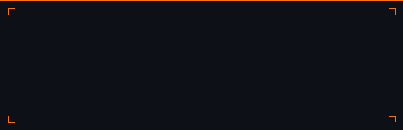

<div align="center">



</div>

---

## ¿De qué va esto?

El periodismo deportivo predice el Draft de la NBA cada año de la misma manera: opiniones de scouts, análisis subjetivos y corazonadas de expertos.

**DraftRadar** propone algo diferente: usar Machine Learning para respaldar análisis periodísticos con datos objetivos. Modelos entrenados con 13 años de estadísticas reales de la NCAA capaces de predecir si un jugador será elegido en el Draft, en qué ronda, en qué rango de pick y a qué perfil físico histórico se parece.

El caso de uso: los tres jugadores españoles con opciones reales en el **NBA Draft 2026**.

---

## ¿Qué predice?

| Predicción | Pregunta | Tipo |
|---|---|---|
| **Ronda** | ¿Primera ronda / Segunda ronda / No drafteado? | Clasificación (3 clases) |
| **Rango de pick** | ¿En qué franja del 1 al 60? | Clasificación multiclase (7 clases) |
| **Arquetipo** | ¿A qué perfil físico histórico se parece? | Clustering no supervisado (K-Means) |

---

## Los protagonistas

| Jugador | Posición | Liga | Mock consensus | Predicción modelo |
|---|---|---|---|---|
| **Aday Mara** | Pívot | ACB · Barça | ~Pick 9 (lotería) | P(draft) = 95.5% · rango 41-50* |
| **Baba Miller** | Ala-Pívot | NCAA · Florida | ~Pick 45 | P(draft) = 94.9% · rango 41-50 ✓ |
| **Sergio de Larrea** | Base | EuroLeague · Valencia | ~Pick 40 (varianza 28-58) | P(draft) = 88.3% · rango 41-50 |

*La infravaloración de Aday es el hallazgo más interesante del proyecto: su valor de lotería está en dimensiones físicas y de techo de desarrollo que las estadísticas de temporada no capturan.

---

## Estructura del repositorio

```
nba-draft-2026-prediccion/
│
├── datos/
│   ├── raw/                          # Fuentes originales sin procesar
│   └── procesados/                   # Datasets limpios listos para los modelos
│       ├── ncaa_final.csv            # 2.121 jugadores · 37 columnas · 0 NaN
│       ├── combine_final.csv         # 1.873 jugadores · 18 columnas · 0 NaN
│       └── nbaplayersdraft_limpio.csv
│
├── notebooks/
│   ├── graficos/                     # Visualizaciones auxiliares
│   ├── limpieza y analisis/          # EDA y limpieza de los tres datasets
│   └── modelos/                      # Notebooks de entrenamiento y evaluación
│       └── memoria_v2.ipynb          # Memoria técnica completa del proyecto
│
├── pkl/
│   ├── modelos/                      # Modelos entrenados (.pkl)
│   ├── preprocesado/                 # Scalers, encoders y PCA
│   └── configuracion/
│       └── configuracion_modelo.yaml
│
├── app_streamlit/
│   └── app.py                        # Aplicación interactiva Streamlit
│
├── codigo/                           # Scripts auxiliares
│
├── logo.gif
└── README.md
```

---

## Fuentes de datos

| Dataset | Dimensiones | Rol |
|---|---|---|
| College Basketball Players 2009-2021 | 61.061 × 66 → 2.121 × 37 | Columna vertebral del modelo predictivo |
| NBA Combine Histórico 2000-2026 | 1.873 × 47 → 1.873 × 18 | Clustering de arquetipos físicos |
| NBA Players Draft | 1.922 × 24 | Enriquecimiento de arquetipos con referentes NBA |

---

## Modelos

### Clustering — Arquetipo físico
- **Algoritmo:** K-Means · k=7 (método del codo)
- **Features:** 7 medidas del Combine (altura, peso, envergadura, alcance, salto, agilidad, sprint)
- **Evaluación:** Silhouette Score 0.16 · PCA para visualización
- **Output:** 7 arquetipos con jugadores NBA de referencia

### Clasificación — Ronda (R1 / R2 / ND)
- **Mejor modelo:** Random Forest sin posición · **F1 macro 0.602**
- **Comparativa:** XGBoost (0.554) · SVM RBF (0.567) · KNN (0.467)
- **AUC-ROC:** ND 0.86 · R1 0.82 · R2 0.82

### Clasificación — Rango de pick (1-10 … 51-60 / ND)
- **Mejor modelo:** XGBoost sin posición · **F1 macro 0.225**
- **Comparativa:** SVM RBF (0.215) · Random Forest (0.214) · KNN (0.186)
- **Nota:** el valor real está en `predict_proba`, no en la clase predicha

---

## Hallazgo principal

El modelo predice ND o R2 para Aday Mara, cuando el consenso lo sitúa en lotería (~pick 9). Eso no es un error: es el hallazgo más valioso del proyecto.

Las estadísticas de temporada no capturan el atletismo, la verticalidad defensiva ni el techo de desarrollo a los 19 años. La brecha entre la predicción estadística y el criterio de los scouts es, en sí misma, una historia periodística.

---

## Aplicación

La app Streamlit tiene tres secciones: predicción personalizada para los tres españoles (card + radar + arquetipo + comparable NBA), modo Mock Draft para cualquier jugador, y explicación accesible de los modelos.

---

## Tecnologías


---

## Autor

**Roberto Cantero** · [@RobertoCantero82](https://github.com/RobertoCantero82)